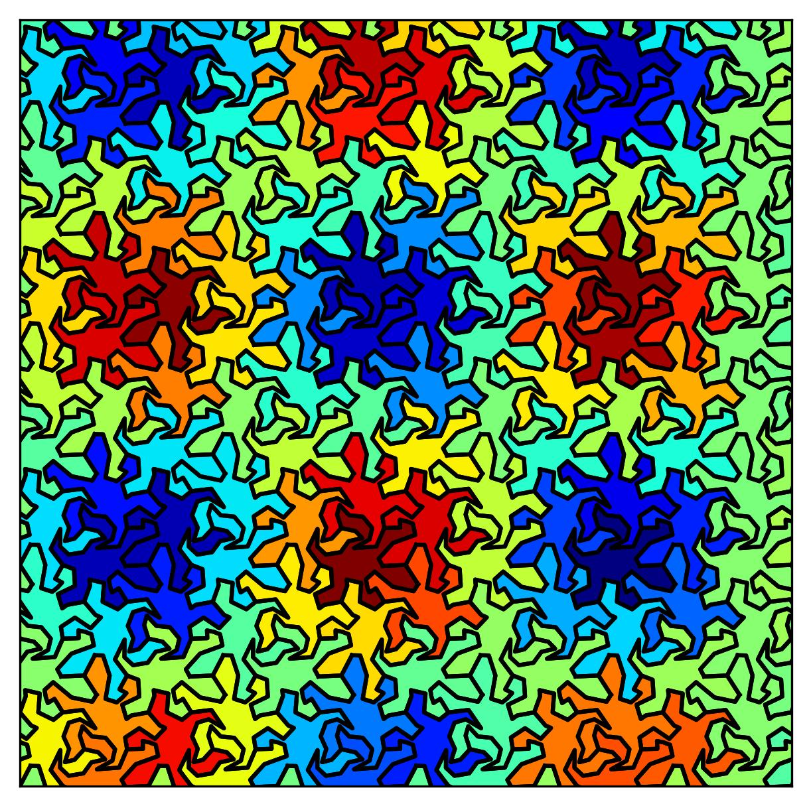

# Crazybin

You think [hexbin](https://matplotlib.org/stable/api/_as_gen/matplotlib.pyplot.hexbin.html) plots are a fancy way to visualize your data? Well, you can go much further... Check out Crazybin to bring your histograms to a whole new level!

Want an example? What about this double sine distribution visualized in the form of [reptiles](https://en.wikipedia.org/wiki/Reptiles_(M._C._Escher)) by [M. C. Escher](https://en.wikipedia.org/wiki/M._C._Escher)?

```python
import numpy as np
import matplotlib.pyplot as plt
from crazybin import crazybin

x=np.linspace(0,10,100)
y=np.linspace(0,10,100)
x,y=np.meshgrid(x,y)
x=x.ravel()
y=y.ravel()
weights=np.sin(x)*np.cos(y)

crazybin(x,y,weights, tile='reptile', cmap='jet', gridsize=4, edgecolor='black')
plt.show()
```



